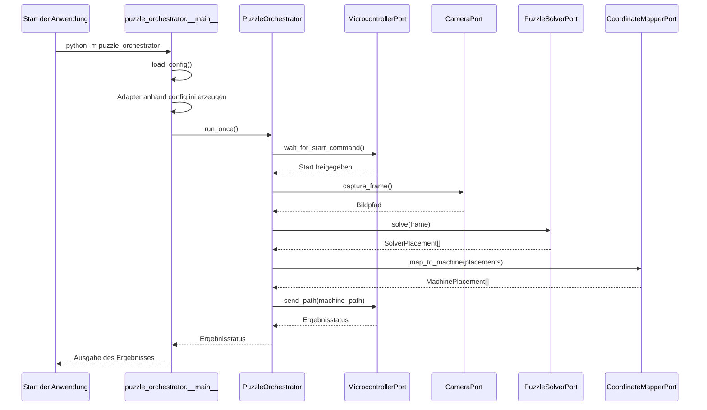
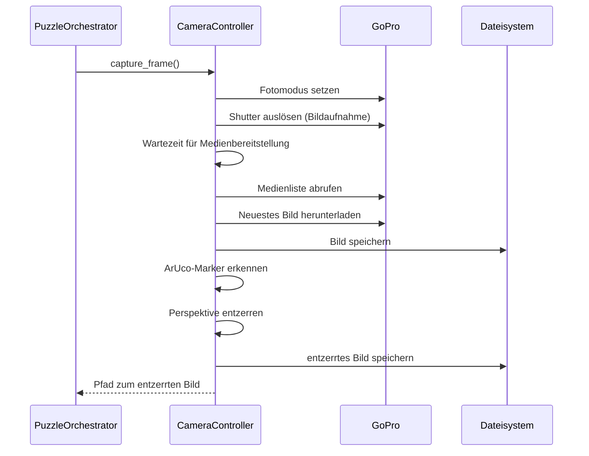
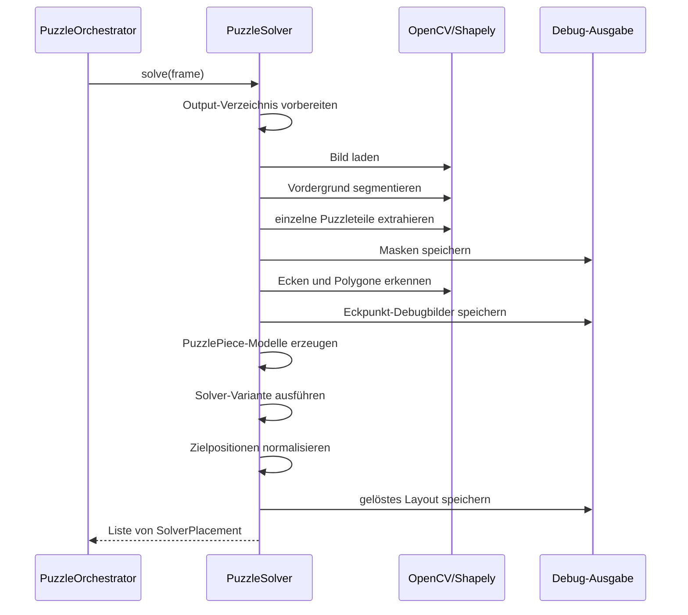
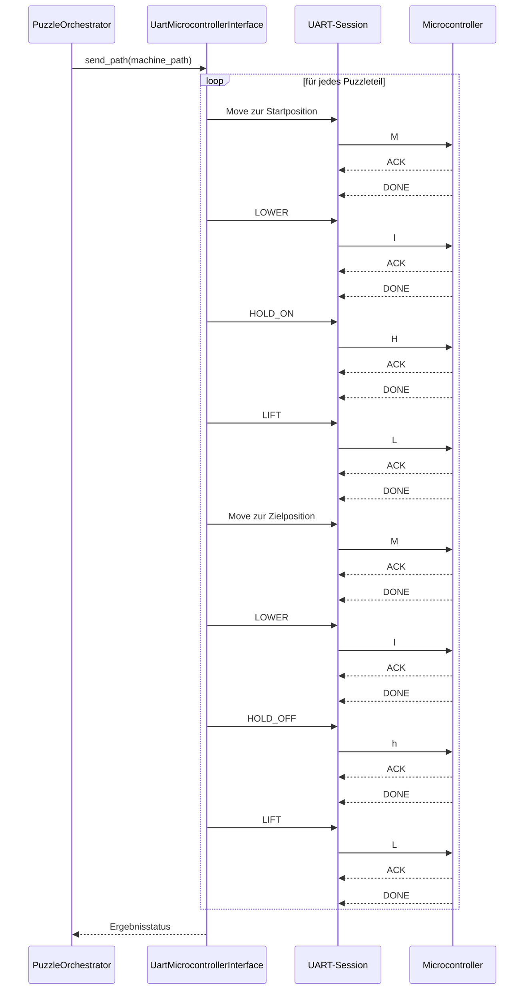

## 6. Laufzeitsicht

Die Anwendung wird als einzelner Orchestrierungsdurchlauf gestartet. Der
`PuzzleOrchestrator` koordiniert dabei alle Verarbeitungsschritte synchron
nacheinander. Die konkreten Adapter für Kamera und Microcontroller werden beim
Start anhand der `config.ini` ausgewählt.

### 6.1 Hauptszenario: Puzzle lösen und Bewegungen ausgeben

### 6.2 Ablauf der Bildaufnahme

Im Mock-Betrieb liefert die Kamera direkt den konfigurierten Bildpfad zurück. Im
GoPro-Betrieb wird die Kamera über HTTP angesprochen.

### 6.3 Ablauf der Puzzle-Lösung

Der Solver verarbeitet das entzerrte Bild zu geometrischen Puzzleteilen und
berechnet daraus eine Zielanordnung.

### 6.4 Ablauf der Microcontroller-Kommunikation

Bei UART-Betrieb wird jede Bewegung beziehungsweise jeder einfache Befehl erst
nach Bestätigung durch den Microcontroller abgeschlossen. Dadurch wird
verhindert, dass Folgekommandos gesendet werden, bevor die Mechanik bereit ist.

### 6.5 Fehlerfälle

Während des Durchlaufs brechen Fehler den aktuellen Lauf ab. Der Einstiegspunkt
protokolliert die Exception und reicht sie weiter.

Typische Fehlerfälle sind:

- Die Konfigurationsdatei fehlt oder enthält ungültige Werte.
- Das Mock-Bild oder Kamerabild kann nicht gelesen werden.
- Die GoPro ist nicht erreichbar oder liefert kein neues Bild.
- ArUco-Marker werden nicht vollständig erkannt.
- Die Segmentierung findet nicht die erwartete Anzahl von Puzzleteilen.
- Der Solver findet keine gültige Anordnung.
- UART liefert kein `ACK`, kein `DONE`, ein `ERROR` oder ein ungültiges Kommando.

Das Programm führt aktuell einen einzelnen Orchestrierungszyklus aus. Wiederholte
Puzzleläufe müssten durch eine äußere Schleife oder einen Prozessmanager ergänzt
werden.
