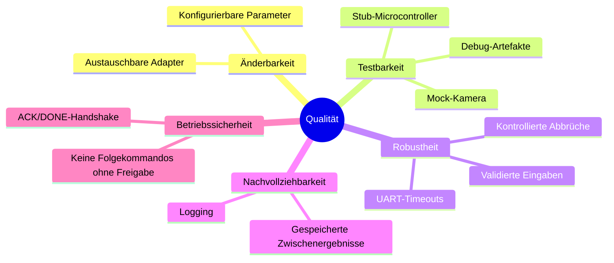

## 10. Qualitätsanforderungen

Die wichtigsten Qualitätsanforderungen ergeben sich aus dem Einsatz mit realer
Hardware, wechselnden Bildbedingungen und der Notwendigkeit, das System auch
ohne vollständigen Aufbau entwickeln zu können.

### 10.1 Qualitätsbaum

### 10.2 Qualitätsszenarien

| Qualität | Szenario | Erwartung |
| --- | --- | --- |
| Testbarkeit | Das System wird ohne GoPro und Microcontroller gestartet. | Mit Mock-Kamera und Stub-Microcontroller kann ein vollständiger Lauf ausgeführt werden. |
| Änderbarkeit | Der Solver-Algorithmus soll gewechselt werden. | Die Änderung erfolgt über `config.ini`, ohne Anpassung am Orchestrator. |
| Robustheit | Die Bildsegmentierung erkennt nicht 4 oder 6 Puzzleteile. | Der Lauf bricht mit einer klaren Fehlermeldung ab. |
| Betriebssicherheit | Der Microcontroller sendet kein `ACK` oder kein `DONE`. | Die Anwendung sendet keine weiteren Kommandos und bricht nach Timeout ab. |
| Nachvollziehbarkeit | Ein Puzzlelauf liefert ein falsches Ergebnis. | Masken, Eckpunkte, Solver-Layout und Logs ermöglichen die Analyse. |
| Portabilität | Das Programm wird auf dem Raspberry Pi 4 Model B ausgeführt. | Die Anwendung läuft mit Python, OpenCV, Shapely und pyserial auf der Zielplattform. |

### 10.3 Priorisierung

| Priorität | Qualitätsanforderung | Begründung |
| --- | --- | --- |
| Hoch | Betriebssicherheit | Fehlerhafte oder zu schnelle Kommandos können die Mechanik gefährden. |
| Hoch | Robustheit | Unerwartete Bild- oder UART-Zustände müssen kontrolliert behandelt werden. |
| Hoch | Testbarkeit | Entwicklung ohne dauerhaft verfügbare Hardware ist notwendig. |
| Mittel | Änderbarkeit | Parameter und Adapter ändern sich während Kalibrierung und Integration häufig. |
| Mittel | Nachvollziehbarkeit | Debug-Artefakte sind wichtig für Bildverarbeitung und Solver-Analyse. |
| Niedrig | Performance | Die Puzzleanzahl ist klein; Korrektheit und kontrollierte Ausführung sind wichtiger als maximale Geschwindigkeit. |
