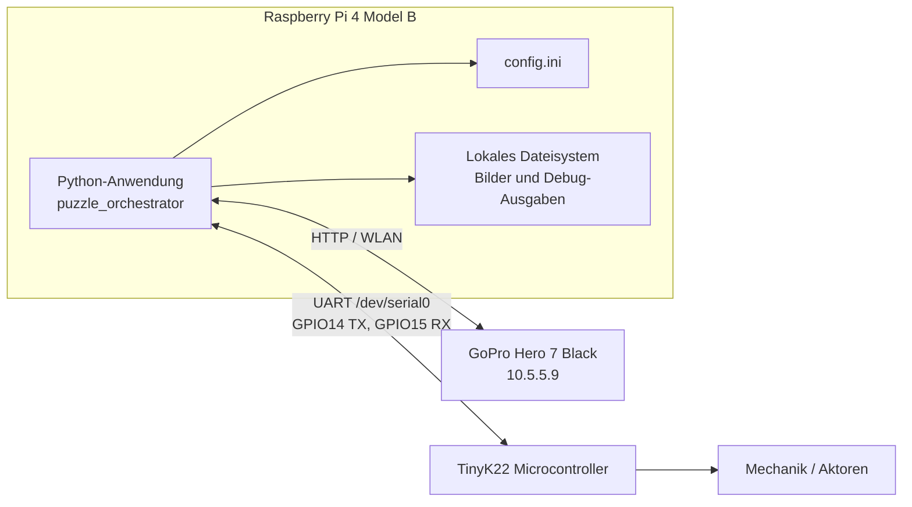

## 7. Verteilungssicht

Das Programm wird im Zielbetrieb auf einem Raspberry Pi 4 Model B ausgeführt.
Der Raspberry Pi übernimmt die zentrale Orchestrierung, Bildverarbeitung,
Puzzle-Lösung, Koordinatentransformation und die Kommunikation mit der
Microcontroller-Steuerung.

### 7.1 Zielumgebung

### 7.2 Knoten

| Knoten | Verantwortung |
| --- | --- |
| Raspberry Pi 4 Model B | Führt die Python-Anwendung aus und ist der zentrale Rechenknoten. |
| GoPro Hero 7 Black | Erstellt das Bild des Puzzlebereichs und stellt es über HTTP bereit. |
| TinyK22 Microcontroller | Nimmt Bewegungsbefehle entgegen und steuert die Mechanik. |
| Mechanik / Aktoren | Führt die Pick-and-Place-Bewegungen physisch aus. |

### 7.3 Laufzeit-Artefakte auf dem Raspberry Pi

Auf dem Raspberry Pi liegen die Anwendung und ihre Konfiguration lokal:

- Python-Paket `puzzle-program`
- Einstiegspunkt `python -m puzzle_orchestrator`
- Konfigurationsdatei `config.ini`
- Kalibrierungsdateien für die Kamera
- temporäre Bilddateien, extrahierte Puzzleteile und Debug-Ausgaben

Die Anwendung läuft als einzelner Python-Prozess. Innerhalb dieses Prozesses
startet die UART-Anbindung bei Bedarf einen Hintergrund-Listener, um eingehende
Microcontroller-Signale wie `ACK`, `DONE`, `ERROR` oder `START` kontinuierlich
zu verarbeiten.

### 7.4 Kommunikationsbeziehungen

| Verbindung | Protokoll / Medium | Zweck |
| --- | --- | --- |
| Raspberry Pi zu GoPro | HTTP über WLAN | Kamera konfigurieren, Foto auslösen, Medienliste abrufen und Bild herunterladen. |
| Raspberry Pi zu TinyK22 | UART über `/dev/serial0` | Startsignal empfangen und Bewegungsbefehle senden. |
| TinyK22 zu Mechanik | Microcontroller-nahe I/O | Motoren, Greifer oder weitere Aktoren steuern. |
| Raspberry Pi zu lokalem Dateisystem | Dateizugriff | Bilder, Masken, erkannte Ecken und Debug-Layouts speichern. |

### 7.5 Netz- und Schnittstellenkonfiguration

Der Raspberry Pi wird für den Zielbetrieb so vorbereitet, dass die
Kameraanbindung und die Microcontroller-Kommunikation verfügbar sind.

Bekannte Adressen und Schnittstellen:

- Raspberry Pi: `192.168.50.2`
- GoPro: `10.5.5.9`
- UART-Port: `/dev/serial0`
- UART-Baudrate: `57600`
- UART TX: GPIO14, Pin 8
- UART RX: GPIO15, Pin 10

Die konkreten Transportvarianten werden über `config.ini` gewählt:

- `camera.transport = gopro` für die reale GoPro
- `camera.transport = mock` für lokale Bilddateien
- `microcontroller.transport = uart` für den TinyK22
- `microcontroller.transport = stub` für Betrieb ohne Microcontroller

### 7.6 Softwarevoraussetzungen

Auf dem Raspberry Pi werden mindestens benötigt:

- Python 3.10 oder neuer
- OpenCV für Bildverarbeitung und ArUco-Erkennung
- Shapely für geometrische Operationen
- pyserial für UART-Kommunikation
- Zugriff auf `/dev/serial0`

Der Zugriff auf die serielle Schnittstelle muss auf dem Raspberry Pi aktiviert
und für den ausführenden Benutzer berechtigt sein.

### 7.7 Entwicklungs- und Testbetrieb

Für Entwicklung und Tests kann das System auf einem Entwicklungsrechner oder auf
dem Raspberry Pi ohne angeschlossene Hardware betrieben werden. In diesem Fall
liefert die Mock-Kamera ein lokales Bild und das Stub-Microcontroller-Interface
simuliert eine erfolgreiche Ausgabe. Die Verteilungsstruktur reduziert sich dann
auf den Python-Prozess und das lokale Dateisystem.
